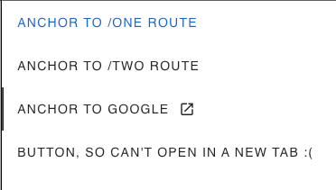

## Setup
```shell
npm install
```
```shell
npm run dev
```
- navigate to [localhost:8000](http://localhost:8000)

## Bug Description
When clicking on a `v-tab` with `href`/`to` property that opens in a 
new window/tab (via either `meta + click` or `target='__blank'`), the slider moves to the clicked tab
rather than staying on the currently active tab.



## How to recreate
1. `meta + click` example
   - Navigate to [localhost:8000/one](http://localhost:8000/one)
   - `meta + click` the tab `ANCHOR TO /TWO ROUTE` which opens link in a new tab
   - You should see the slider move to the second tab and the text `Card Two`
2. `target='__blank'` example
    - Navigate to [localhost:8000/one](http://localhost:8000/one)
    - Click on the `ANCHOR TO GOOGLE` tab which opens link in a new tab
    - You should see the slider move to the third tab and the text `You should never see this`